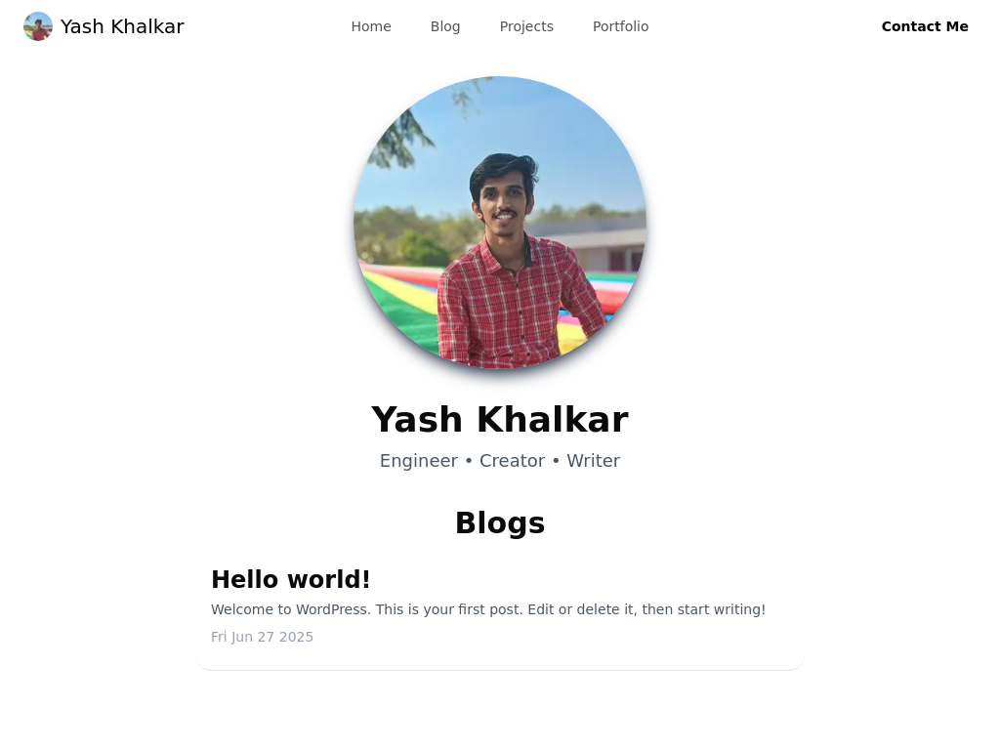

# 📝 Yash Khalkar Blog Platform (Next.js + WordPress Headless)

A modern, full-stack personal blogging platform built with a **Next.js frontend** and a **WordPress backend** (headless CMS) using **GraphQL**, **Apollo Client**, **Tailwind CSS**, and **Docker**. Fully styled, performant, and deployable on free tiers.

---

## 🔧 Technologies Used

### Frontend (Next.js)

* **Next.js App Router**
* **Tailwind CSS v4**
* **Apollo Client** (GraphQL integration)
* **Dynamic metadata** for SEO
* **Responsive UI**

### Backend (WordPress Headless)

* **Dockerized WordPress** setup
* **WPGraphQL** plugin
* **Google Site Kit** plugin (for future analytics/adsense)
* **MySQL** (via Aiven)
* **Render Free Tier** for hosting

---

## 📁 Project Structure

```bash
root/
├── frontend/                 # Next.js frontend
│   ├── app/
│   │   ├── page.tsx          # Homepage
│   │   ├── blog/[slug]/      # Blog detail pages
│   │   │   ├── page.tsx
│   │   │   ├── loading.tsx   # Loading skeleton
│   │   │   └── layout.tsx    # Blog-specific layout
│   │   └── loading.tsx       # Homepage loading skeleton
│   │   └── layout.tsx        # App layout
│   ├── components/           # Reusable UI
│   ├── graphql/              # GraphQL queries
│   ├── lib/apollo.ts         # Apollo Client setup
│   └── tailwind.config.js    # Tailwind customization
│
├── backend/                  # WordPress (headless)
│   ├── Dockerfile            # Custom WP build with plugins
│   ├── docker-compose.yml    # For local dev
│   └── render.yaml           # For deployment
```

---

## 🚀 Getting Started

### 🔹 1. Clone the Repository

```bash
git clone https://github.com/KhalkarYash/wp-blog-next
cd wp-blog-next
```

### 🔹 2. Set Up Backend (Docker WordPress)

```bash
cd backend
# Add your .env file or set variables in Render
# Start locally
docker-compose up --build
```

#### Required ENV Vars

```env
WORDPRESS_DB_HOST=your-db-host
WORDPRESS_DB_NAME=wordpress
WORDPRESS_DB_USER=username
WORDPRESS_DB_PASSWORD=password
```

### 🔹 3. Set Up Frontend

```bash
cd frontend
npm install
npm run dev
```

#### Required ENV Vars

```env
NODE_ENV=production/development
```

### 🔹 4. Configure GraphQL Plugins

* Activate **WPGraphQL** plugin

---

## ✨ Features

* ✅ Individual blog pages with loading skeleton
* ✅ SEO metadata per page/post
* ✅ Clean responsive UI with Tailwind
* ✅ Blog content managed via WordPress + GraphQL

---

## 📈 Optional Integrations

* Google AdSense
* Analytics via Google Site Kit

---

## 📦 Deployment

### Backend:

* Deploy `backend/` on [Render](https://blog-backend-yashkhalkar.onrender.com/)
* Ensure DB credentials match with your Aiven config

### Frontend:

* Deploy `frontend/` on [Vercel](https://blogs-yashkhalkar.vercel.app/)

---

## 📷 Screenshot:



---

## 📮 Contact

Built and maintained by [Yash Khalkar](https://yashkhalkar.vercel.app). Feel free to open issues or contribute.

---

## 📜 License

MIT — free to use and modify.
